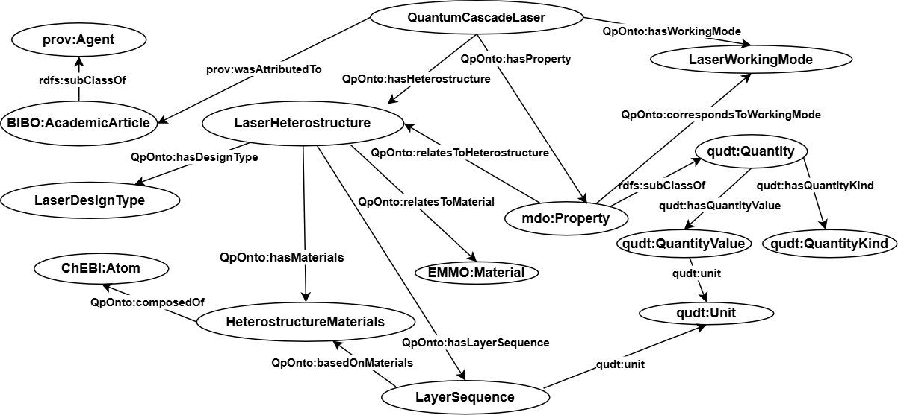

## An Ontological Model of Properties in the Quantum Cascade Laser Domain
### Introduction
* We propose an ontological representation of heterostructure and optoelectronic characteristics in the quantum cascade laser domain. The main aim of the ontology is to modell the relationship between the quantum cascade laser design features (Heterostructure) and the laser optoelectronic characteristics i.e the performance features of the laser as a result of injection of current in the laser structure.
* The ontological representation captures the laser design features, the performance/optoelectronic characteristics, the laser working mode and the equivalent provenance references for this information.
### Ontology Concepts and Relations

### Publication and Citation
Kerre, D., Laurent, A., Maussang, K., & Owuor, D. (2025). A Concise Ontological Model of the Design and Optoelectronic Properties in the Quantum Cascade Laser Domain. Semantic Web, 16 (4), 1-17. [DOI:10.1177/22104968251359870](https://doi.org/10.1177/22104968251359870)
### License
This work is licensed under a [Creative Commons Attribution 4.0 International
License](http://creativecommons.org/licenses/by/4.0/).

### Acknowledgements
Funded by the French Embassy in Kenya (Scientific and Academic Cooperation Department), Strathmore University (Doctoral Academy) and the CNRS (under the framework “Dispositif de Soutien aux Collaborations avec l’Afrique sub-saharienne").
